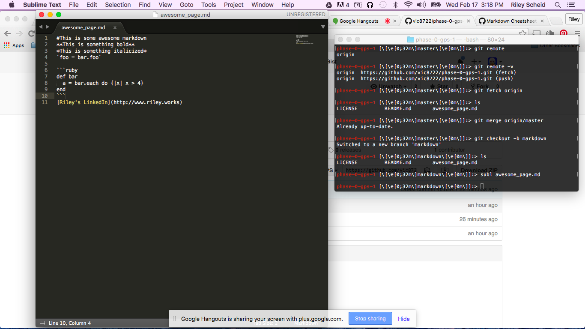

#This is some awesome markdown
**This is something bold**
*This is something italicized*
`food = bar.foo`

```ruby
def bar
	a = bar.each {|x| x > 4}
end
```
[Riley's LinkedIn](http://www.riley.works)
